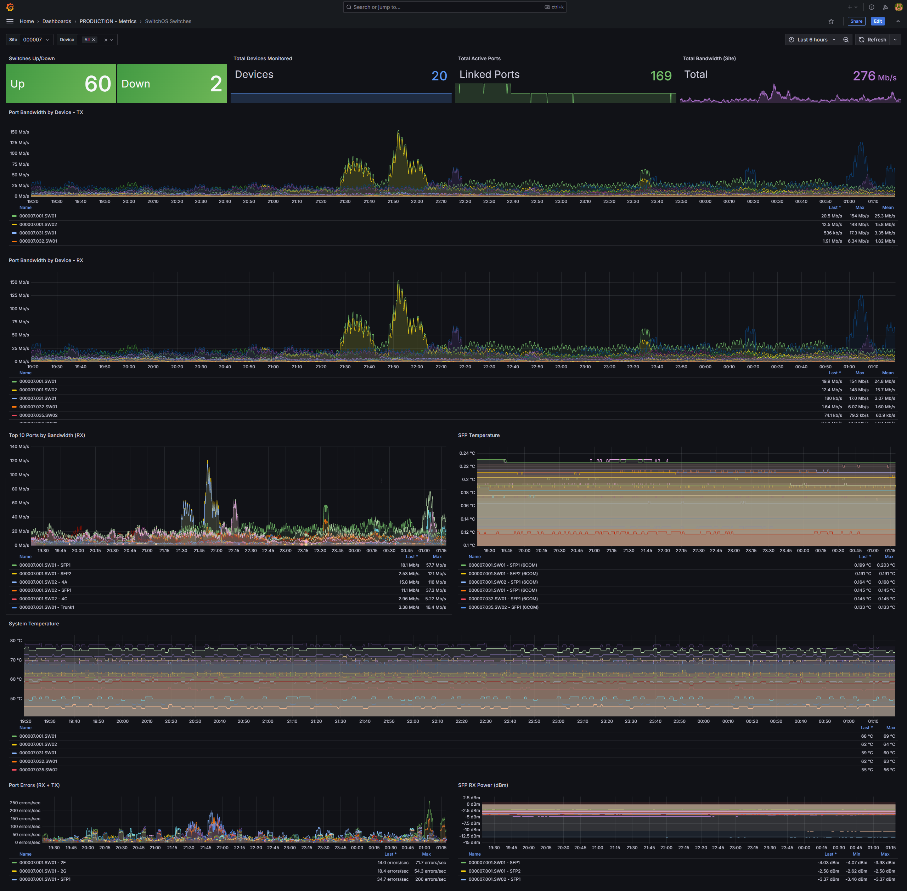

# MikroTik SwitchOS Prometheus Exporter

A comprehensive Prometheus exporter for MikroTik switches running SwitchOS. This exporter discovers devices from Netbox API and collects detailed metrics including port status, SFP module information, VLAN configuration, MAC address tables, and system information.



## Features

- **Automatic Device Discovery**: Fetches MikroTik switches from Netbox API based on configurable filters
- **Comprehensive Metrics Collection**: 
  - Device status and system information
  - Port status, link state, and statistics
  - SFP module temperature and optical power levels
  - VLAN configuration and membership
  - MAC address table entries
- **Multi-site Support**: Includes site labels for monitoring across multiple locations
- **HTTP Digest Authentication**: Secure authentication with SwitchOS devices
- **Prometheus Compatible**: Standard Prometheus metrics format with proper label sanitization

## Architecture

The exporter consists of three main components:

1. **Netbox Client** (`netbox_client.py`): Discovers MikroTik switches from Netbox API
2. **SwitchOS Client** (`switchos_client.py`): Communicates with switches and parses metrics
3. **Prometheus Exporter** (`switchos_exporter.py`): Exposes metrics in Prometheus format

## Metrics Collected

### Device Metrics
- `switchos_device_up`: Device reachability status (1=up, 0=down)
- `switchos_collection_duration_seconds`: Time spent collecting metrics
- `switchos_system_uptime_seconds`: System uptime
- `switchos_system_temperature_celsius`: System temperature

### Port Metrics
- `switchos_port_status`: Port enabled status (1=enabled, 0=disabled)
- `switchos_port_link_status`: Port link status (1=linked, 0=down)
- `switchos_port_speed_mbps`: Port speed in Mbps
- `switchos_port_rx_bytes_total`: Total received bytes
- `switchos_port_tx_bytes_total`: Total transmitted bytes
- `switchos_port_rx_packets_total`: Total received packets
- `switchos_port_tx_packets_total`: Total transmitted packets
- `switchos_port_rx_errors_total`: Total receive errors
- `switchos_port_tx_errors_total`: Total transmit errors

### VLAN Metrics
- `switchos_vlan_count`: Number of configured VLANs
- `switchos_vlan_port_members`: Number of member ports in VLAN

### MAC Table Metrics
- `switchos_mac_table_entries`: Total MAC address table entries
- `switchos_mac_table_entries_by_vlan`: MAC entries per VLAN

### SFP Module Metrics
- `switchos_sfp_temperature_celsius`: SFP module temperature
- `switchos_sfp_tx_power_mw`: SFP TX power in milliwatts
- `switchos_sfp_rx_power_mw`: SFP RX power in milliwatts

### Device Information
- `switchos_device_info`: Device metadata (version, model, serial, etc.)

## Configuration

Create a `.env` file with the following configuration:

```bash
# SwitchOS Authentication
user=admin
password=your_switch_password

# Netbox Configuration
netbox_api_token=your_netbox_api_token_here
netbox_api_url=http://your-netbox-server:8000/api/

# Netbox Device Filters
netbox_manufacturer=MikroTik
netbox_platform=SwitchOS
netbox_tags=Monitoring
```

## Installation and Deployment

### Prerequisites

- Python 3.10+ or Docker
- Network access to Netbox API and MikroTik switches
- MikroTik switches with SwitchOS and HTTP API enabled

### Method 1: Direct Python Deployment

1. **Install Dependencies**:
   ```bash
   pip install -r requirements.txt
   ```

2. **Configure Environment**:
   ```bash
   cp .env.example .env
   # Edit .env with your credentials and Netbox configuration
   ```

3. **Run the Exporter**:
   ```bash
   python3 switchos_exporter.py
   ```

4. **Verify Operation**:
   ```bash
   curl http://localhost:9000/metrics
   ```

### Method 2: Docker Deployment

1. **Configure Environment**:
   ```bash
   cp .env.example .env
   # Edit .env with your credentials and Netbox configuration
   ```

2. **Build and Deploy**:
   ```bash
   docker compose build
   docker compose up -d
   ```

3. **Monitor Logs**:
   ```bash
   docker compose logs -f
   ```

4. **Verify Operation**:
   ```bash
   curl http://localhost:9000/metrics
   ```

## Docker Configuration

The Docker deployment includes:

- **Resource Limits**: 2 CPU cores max, 1GB memory max
- **Health Checks**: Automatic health monitoring on metrics endpoint
- **Logging**: Structured JSON logs with rotation
- **Security**: Non-root user execution
- **Persistence**: Volume mounts for logs and configuration

## Prometheus Configuration

Add the following to your Prometheus configuration:

```yaml
scrape_configs:
  - job_name: 'switchos-exporter'
    static_configs:
      - targets: ['localhost:9000']
    scrape_interval: 60s
    scrape_timeout: 30s
```

## Monitoring and Alerting

### PromQL Queries

For a comprehensive collection of ready-to-use PromQL queries, see **[PROMQL_QUERIES.md](PROMQL_QUERIES.md)**.

This includes queries for:
- Port bandwidth and traffic analysis
- Port status and health monitoring
- Device health and uptime
- SFP metrics and diagnostics
- Top N analysis
- Alerting queries
- Grafana dashboard examples

### Quick Examples

**Port RX Bandwidth (Mbps)**:
```promql
rate(switchos_port_rx_bytes_total[5m]) * 8 / 1000000
```

**Port TX Bandwidth (Mbps)**:
```promql
rate(switchos_port_tx_bytes_total[5m]) * 8 / 1000000
```

**Device Status**:
```promql
switchos_device_up
```

**Top 10 Ports by Bandwidth**:
```promql
topk(10, rate(switchos_port_rx_bytes_total[5m]) * 8 / 1000000)
```

**SFP Temperature**:
```promql
switchos_sfp_temperature_celsius
```

**Site-based Filtering**:
```promql
rate(switchos_port_rx_bytes_total{site="000001"}[5m]) * 8 / 1000000
```

### Sample Alerts

```yaml
groups:
  - name: switchos
    rules:
      - alert: SwitchDown
        expr: switchos_device_up == 0
        for: 2m
        labels:
          severity: critical
        annotations:
          summary: "Switch {{ $labels.device_name }} is down"

      - alert: SFPHighTemperature
        expr: switchos_sfp_temperature_celsius > 70
        for: 5m
        labels:
          severity: warning
        annotations:
          summary: "SFP module temperature high on {{ $labels.device_name }}"
```

## Troubleshooting

### Common Issues

1. **Device shows as down**: Check network connectivity and credentials
2. **No metrics appearing**: Verify Netbox filters match your device configuration
3. **Authentication errors**: Confirm SwitchOS credentials and HTTP API access
4. **Label errors**: Ensure device names don't contain invalid characters

### Debugging

1. **Check container logs**:
   ```bash
   docker compose logs switchos-exporter
   ```

2. **Test connectivity**:
   ```bash
   curl -u admin:password http://switch-ip/link.b
   ```

3. **Verify Netbox API**:
   ```bash
   curl -H "Authorization: Token your-token" http://netbox-url/api/dcim/devices/
   ```

### Performance Tuning

- **Collection Interval**: Modify `collection_interval=60` in `switchos_exporter.py`
- **Resource Limits**: Adjust Docker resource limits in `docker-compose.yml`
- **Concurrent Collection**: Consider threading for multiple devices

## Development

### Project Structure
```
switchos-exporter/
├── switchos_exporter.py    # Main exporter application
├── netbox_client.py        # Netbox API client
├── switchos_client.py      # SwitchOS communication
├── requirements.txt        # Python dependencies
├── Dockerfile             # Container definition
├── docker-compose.yml     # Docker deployment
├── .env.example          # Configuration template
└── README.md            # This file
```

### Contributing

1. Follow Python PEP 8 style guidelines
2. Add appropriate logging for debugging
3. Test with both Python and Docker deployments
4. Update documentation for new features

## License

This project is licensed under the [GNU Affero General Public License v3.0 (AGPL-3.0)](LICENSE).
